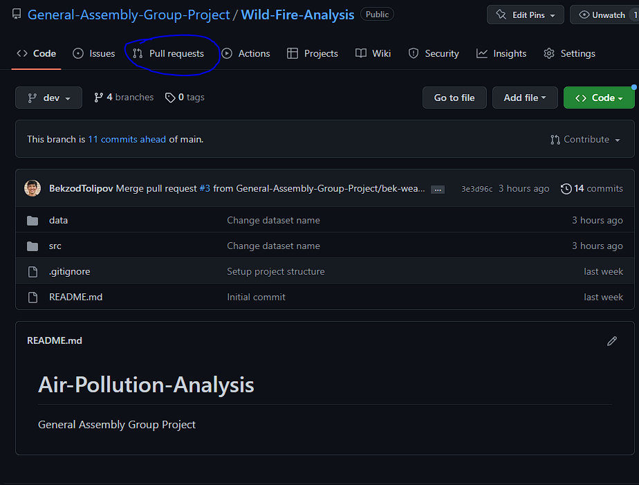
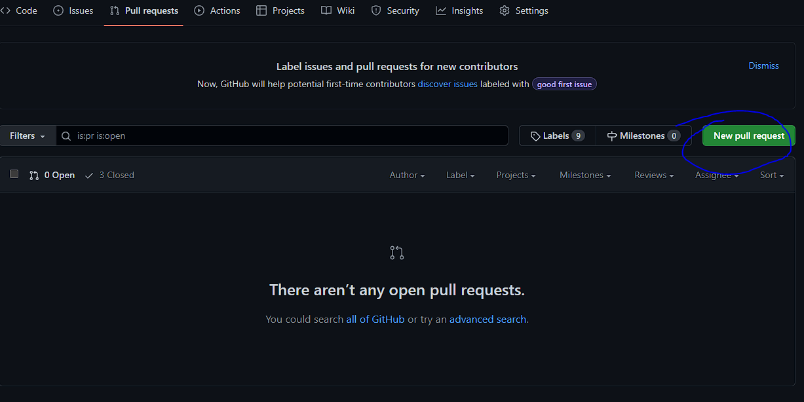
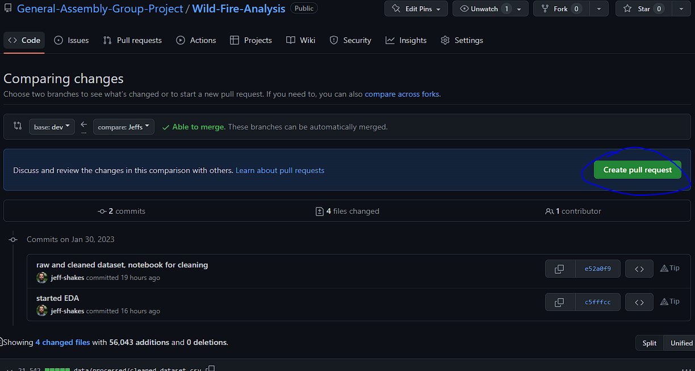
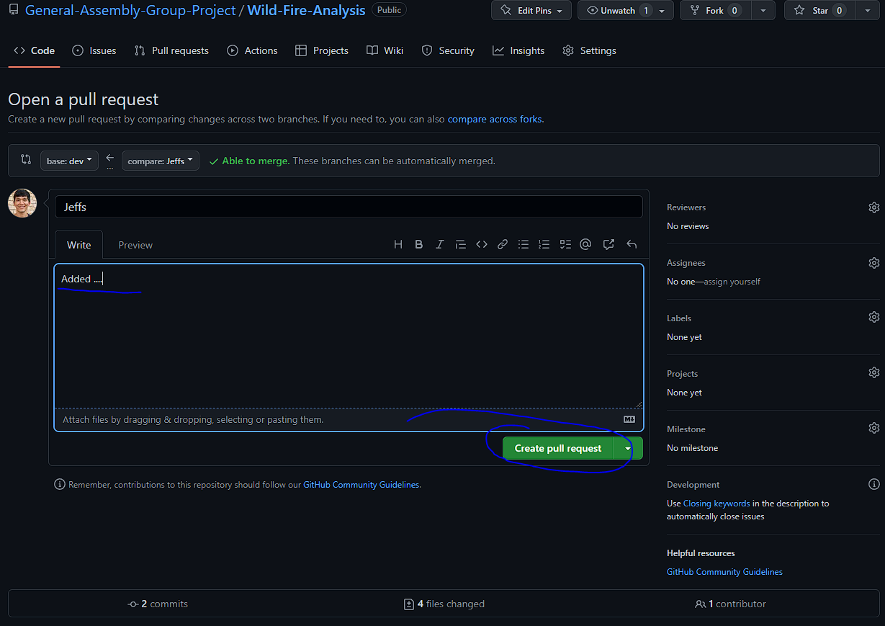
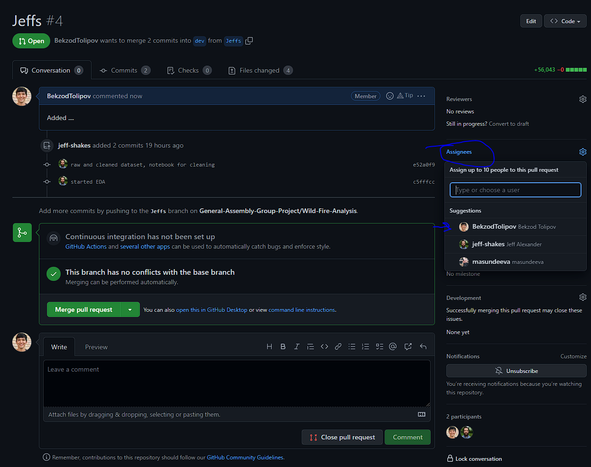

# Wild Fire Analysis

## Group Work Git Process

- Create your own branch from `dev` branch: `git checkout -b initials_cleaning_eda dev`
- Your `code` should go to inside folders of `src` folder
- Your `jupyter` file should be named as foldername. For example: if folder `02_processing` than file name should be `processing.ipynb`
- 
  
  Click on `Pull requests` tab

- 

  Click on `New pull request`

- 

  Pick `your branch` that you want to merge and target branch `dev` and click on `Create pull request`

- 

  Add comment of your work and click on `Create pull request`

- 

  Click on `Assignees` and pick the user to review your work. 
   :warning: **Do not merge your work yourself**: Be very careful here! Also your branch will be automatically deleted!