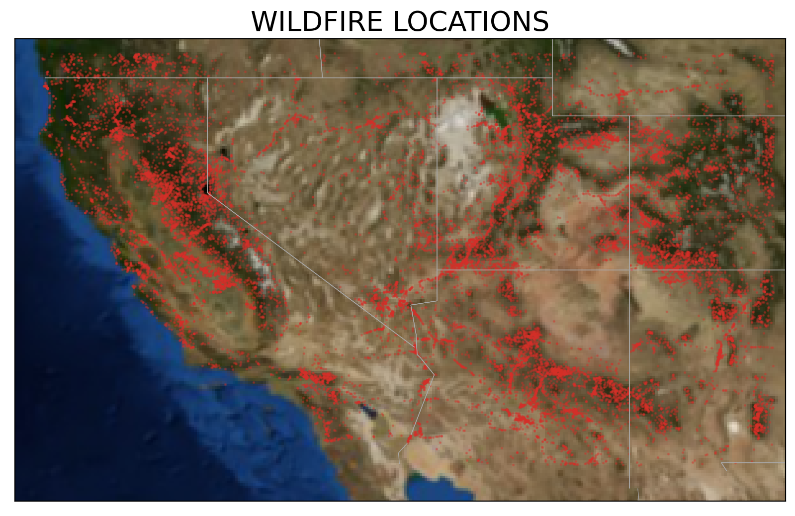

# Project 4: Wildfire Acreage Prediction

## Table of Contents
* 00_collect_data
  * landcover_data_collection
  * meteorology_data_collection_api_meteostat
  * meteorology_data_collection_api_POWER
  * wildfire_data_collection
* 01_cleaning_eda
  * 01.1_wildfires_cleaning
  * 01.2_meteorology_cleaning
  * 01.3_basic_EDA
  * 01.4_extended_EDA
* 02_processing
  * 02.1_meteorology_historical_preprocessing
  * 02.2_merging_data
* 03_modeling
  * ...

---
## Problem Statement
Using only the reported initial location of a wildfire, can we use the historical and present meteorological data and land cover zoning data to predict the total acres burned? What variability of predicted wildfire acreage could be explained by only meteorological data and vegetation type?

---
## Python Libraries
Following python libraried were used during the project:
  - `pandas`
  - `numpy`
  - `seaborn`
  - `matplotlib`
  - `sklearn`
  - `nltk`
  - `meteostat`
  - `POWER-api`
  - `mpl_toolkits.basemap`
---
## Datasets
During the project, we collected the following data to be used as predictors:
1. Wildfires dataset covering south-western portion of the US
1. Current meteorological data, including atmospheric measurements like temperature, wind, air humidity, soil humidity, UV index etc.
2. Historical precipitation for 6 months preceding the fire start date
3. Land cover data, describing what type of vegetation is the dominant in the start location of the fire

---
## Data Collection
 The biggest part of data collection was getting meteorological data. It was acquired using [POWER API](https://power.larc.nasa.gov/docs/methodology/data/sources/), which utilizes space-based data from the meteo satellites. We've also tried using Meteostat API that is using ground-based meteo data, but it's coverage wasn't good enough for our goals.  
 Wildfires data came from [WFIGS Wildland Fire Locations](https://data-nifc.opendata.arcgis.com/datasets/nifc::wfigs-wildland-fire-locations-full-history/about) which are reported by IRWIN wildland fires reporting and management system.  
Land Cover data was collected from [GAP/LANDFIRE National Terrestrial Ecosystems](https://www.usgs.gov/programs/gap-analysis-project/science/land-cover-data-overview) dataset.

---
## Data Cleaning
We did some extensive cleaning of wildfire entries, by removing 'tiny' fires which are less than 1 acre and took less than one day to contain. 
In general data cleaning of weather and wildfires dataset involved removal of missing values, invalid entries and a lot of preprocessing.
Land cover data layer was preprocessed in QGIS, where its resolution was downsampled from 30 meters to 1 kilometer by getting the most frequent land cover category from the source dataset. By spatial intersection of wildfires' starting points and land cover raster, we got the csv file containing land cover category per incident.

---
## EDA
During EDA, we've made sure to explore our data well enough to figure out any patterns. In general, wildfires data we worked with has a lot of variance and it's hard to detect any patterns apart. This is probably why modeling was challenging as well

### Variance of fire data

  
### Seasonality of precipitation and fires:

### Most burned vegetation types:

----
## Conclusion & Recommendation
We utilized dozens of different machine learning models with extensive parameters tuning...

----
## Conclusion & Recommendation
We utilized dozens of different machine learning models with extensive parameters tuning...

---
## Data Dictionary

| Features                | Data Types | Description                                                                                                                                                                                                                                                                                                         |
| :---------------------- | :--------- | :------------------------------------------------------------------------------------------------------------------------------------------------------------------------------------------------------------------------------------------------------------------------------------------------------------------ |
| T2M                     | float64    | The average air (dry bulb) temperature at 2 meters above the surface of the earth.                                                                                                                                                                                                                                  |
| T2M_MAX                 | float64    | The maximum hourly air (dry bulb) temperature at 2 meters above the surface of the earth in the period of interest.                                                                                                                                                                                                 |
| QV2M                    | float64    | The ratio of the mass of water vapor to the total mass of air at 2 meters (g water/kg total air).                                                                                                                                                                                                                   |
| PRECTOTCORR             | float64    | The bias corrected average of total precipitation at the surface of the earth in water mass (includes water content in snow).                                                                                                                                                                                       |
| WS2M                    | float64    | The average of wind speed at 2 meters above the surface of the earth.                                                                                                                                                                                                                                               |
| WS2M_MAX                | float64    | The maximum hourly wind speed at 2 meters above the surface of the earth.                                                                                                                                                                                                                                           |
| WS10M                   | float64    | The average of wind speed at 10 meters above the surface of the earth.                                                                                                                                                                                                                                              |
| WS10M_MAX               | float64    | The maximum hourly wind speed at 10 meters above the surface of the earth.                                                                                                                                                                                                                                          |
| GWETTOP                 | float64    | The percent of soil moisture a value of 0 indicates a completely water-free soil and a value of 1 indicates a completely saturated soil; where surface is the layer from the surface 0 cm to 5 cm below grade.                                                                                                      |
| GWETPROF                | float64    | The percent of profile soil moisture a value of 0 indicates a completely water-free soil and a value of 1 indicates a completely saturated soil; where profile is the layer from the surface down to the bedrock.                                                                                                   |
| T2MDEW                  | float64    | The dew/frost point temperature at 2 meters above the surface of the earth.                                                                                                                                                                                                                                         |
| T2MWET                  | float64    | Wet Bulb Temperature at 2 Meters                                                                                                                                                                                                                                                                                    |
| RH2M                    | float64    | The ratio of actual partial pressure of water vapor to the partial pressure at saturation, expressed in percent.                                                                                                                                                                                                    |
| CLRSKY_SFC_PAR_TOT      | float64    | Clear Sky Surface PAR Total                                                                                                                                                                                                                                                                                         |
| ALLSKY_SFC_PAR_TOT      | float64    | All Sky Surface PAR Total                                                                                                                                                                                                                                                                                           |
| ALLSKY_SFC_UV_INDEX     | float64    | All Sky Surface UV Index                                                                                                                                                                                                                                                                                            |
| PRECTOTCORR_SUM         |            | Precipitation Corrected Sum                                                                                                                                                                                                                                                                                         |
| tavg                    | float64    | The average air temperature in °C                                                                                                                                                                                                                                                                                   |
| tmin                    | float64    | The minimum air temperature in °C                                                                                                                                                                                                                                                                                   |
| tmax                    | float64    | The maximum air temperature in °C                                                                                                                                                                                                                                                                                   |
| prcp                    | float64    | The daily precipitation total in mm                                                                                                                                                                                                                                                                                 |
| snow                    | float64    | The maximum snow depth in mm                                                                                                                                                                                                                                                                                        |
| wdir                    | float64    | The average wind direction in degrees (°)                                                                                                                                                                                                                                                                           |
| wspd                    | float64    | The average wind speed in km/h                                                                                                                                                                                                                                                                                      |
| wpgt                    | float64    | The peak wind gust in km/h                                                                                                                                                                                                                                                                                          |
| pres                    | float64    | The average sea-level air pressure in hPa                                                                                                                                                                                                                                                                           |
| tsun                    | float64    | The daily sunshine total in minutes (m)                                                                                                                                                                                                                                                                             |
| station                 | float64    | The weather station ID                                                                                                                                                                                                                                                                                              |
| X                       | float64    | Centroid of Latitude                                                                                                                                                                                                                                                                                                |
| Y                       | float64    | Centroid of Longitude                                                                                                                                                                                                                                                                                               |
| ContainmentDateTime     | object     | The date and time a wildfire was declared contained.                                                                                                                                                                                                                                                                |
| ControlDateTime         | object     | The date and time a wildfire was declared under control.                                                                                                                                                                                                                                                            |
| DailyAcres              | float64    | A measure of acres reported for a fire.  More specifically, the number of acres within the current perimeter of a specific, individual incident, including unburned and unburnable islands.  The minimum size must be 0.1.                                                                                          |
| DiscoveryAcres          | float64    | An estimate of acres burning upon the discovery of the fire. More specifically when the fire is first reported by the first person that calls in the fire.  The estimate should include number of acres within the current perimeter of a specific, individual incident, including unburned and unburnable islands. |
| FireCause               | object     | Broad classification of the reason the fire occurred identified as human, natural or unknown.                                                                                                                                                                                                                       |
| FireDiscoveryDateTime   | object     | The date and time a fire was reported as discovered or confirmed to exist.  May also be the start date for reporting purposes.                                                                                                                                                                                      |
| IncidentTypeCategory    | object     | The Event Category is a sub-group of the Event Kind code and description. The Event Category further breaks down the Event Kind into more specific event categories.                                                                                                                                                |
| IncidentTypeKind        | object     | A general, high-level code and description of the types of incidents and planned events to which the interagency wildland fire community responds.                                                                                                                                                                  |
| InitialLatitude         | float64    | The latitude location of the initial reported point of origin specified in decimal degrees.                                                                                                                                                                                                                         |
| InitialLongitude        | float64    | The longitude location of the initial reported point of origin specified in decimal degrees.                                                                                                                                                                                                                        |
| IrwinID                 | object     | Unique identifier assigned to each incident record in IRWIN.                                                                                                                                                                                                                                                        |
| LocalIncidentIdentifier | int64      |                                                                                                                                                                                                                                                                                                                     |
| POOCounty               | object     | The County Name identifying the county or equivalent entity at point of origin designated at the time of collection.                                                                                                                                                                                                |
| POODispatchCenterID     | object     | A unique identifier for the dispatch center that intersects with the incident point of origin.                                                                                                                                                                                                                      |
| POOFips                 | int64      | The code which uniquely identifies counties and county equivalents.  The first two digits are the FIPS State code and the last three are the county code within the state.                                                                                                                                          |
| POOState                | object     | The State alpha code identifying the state or equivalent entity at point of origin.                                                                                                                                                                                                                                 |
| UniqueFireIdentifier    | object     | Unique identifier assigned to each wildland fire.  yyyy = calendar year, SSUUUU = POO protecting unit identifier (5 or 6 characters), xxxxxx = local incident identifier (6 to 10 characters)                                                                                                                       |
| id                      | int64      | Unique ID                                                                                                                                                                                                                                                                                                           |
| Count                      | int64      | Number of pixels with particular value                                                                                                                                                                                                                                                                                                            |
| Value                      | int64      | Unique value of land cover zone                                                                                                                                                                                                                                                                                                            |
| RED                      | float64      | Red channel of given pixel                                                                                                                                                                                                                                                                                                            |
| GREEN                      | float64      | Green channel of given pixel                                                                                                                                                                                                                                                                                                            |
| BLUE                      | float64      | Blue channel of given pixel                                                                                                                                                                                                                                                                                                           |
| CL                      | int64      | Code: Class                                                                                                                                                                                                                                                                                                           |
| NVC_CLASS                      | object      | Class: dominant general growth forms adapted to basic moisture, temperature, and/or substrate or aquatic                                                                                                                                                                                                                                                                                                            |
| SC                      | object      | Code: Subclass                                                                                                                                                                                                                                                                                                           |
| NVC_SUBCL                      | object      |  Subclass: global macroclimatic factors driven primarily by latitide and continental postion, or reflect overriding substrate or  aquatic condtions                                                                                                                                                                                                                                                                                                            |
| FRM                      | object      | Code: Formation                                                                                                                                                                                                                                                                                                           |
| NVC_FORM                      | object      |  Formation: global macroclimatic conditions as modified by altitide, seasonality of precipitation, substrates, hydrological conditions                                                                                                                                                                                                                                                                                                            |
| DIV                      | object      | Code: Division                                                                                                                                                                                                                                                                                                           |
| NVC_DIV                      | object      | Division:  continental differences in mesoclimate, geology, substrates, hydrology, disturbance regimes                                                                                                                                                                                                                                                                                                            |
| MACRO_CD                      | object      | Code: Macrogroup                                                                                                                                                                                                                                                                                                            |
| NVC_MACRO                      | object      | Macrogroup: sub-continental to regional differences in mesoclimate, geology, substrates, hydrology, disturbance regimes                                                                                                                                                                                                                                                                                                            |
| GR                      | object      | Code: Group                                                                                                                                                                                                                                                                                                           |
| NVC_GROUP                      | object      | Group: regional differences in mesoclimate, geology, substrates, hydrology, disturbance regimes                                                                                                                                                                                                                                                                                                            |
| LEVEL3                       | int64      | Code: Level                                                                                                                                                                                                                                                                                                            |
| ECOLSYS_LU                      | object      |  Level description                                                                                                                                                                                                                                                                                                           |
| NVCMES                       | object      |  Code of the sublevel                                                                                                                                                                                                                                                                                                            |