# Project 4: Wild Fire Analysis

## Table of Contents
- [Project 4: Wild Fire Analysis](#project-4-wild-fire-analysis)
  - [Table of Contents](#table-of-contents)
  - [Overview](#overview)
  - [Problem-Statement](#problem-statement)
  - [Datasets](#datasets)
  - [Analysis Summary](#analysis-summary)
    - [Overall Data Analysis](#overall-data-analysis)
  - [Conclusion \& Recommendation](#conclusion--recommendation)

## Overview

Data Analysis has been conducted using following libraries:
  - `pandas`
  - `numpy`
  - `seaborn`
  - `matplotlib`
  - `skylearn`
    - `BaggingClassifier`
    - `RandomForestClassifier`
    - `ExtraTreesClassifier`
    - `GradientBoostingClassifier`
    - `AdaBoostClassifier`
    - `VotingClassifier`
    - `StackingClassifier`
    - `confusion_matrix`
    - `ConfusionMatrixDisplay`
    - `classification_report`
    - `RocCurveDisplay`
    - `accuracy_score`
    - `Pipelin`
    - `train_test_split`
    - `GridSearchCV`
    - `cross_val_score`
    - `cross_val_predict`
    - `make_column_transformer`
    - `StandardScaler`
    - `MultinomialNB`
    - `LogisticRegression`
    - `KNeighborsClassifier`
    - `CountVectorizer` 
    - `TfidfVectorizer`
  - `nltk`
    - `SentimentIntensityAnalyzer`
    - `PorterStemmer`
  - `meteostat`
  - `POWER-api`

## Problem-Statement
Using only the reported initial location of a wildfire, can we use the historical and present weather and land data to predict the total acres burned? 

## Datasets
| Features                | Data Types | Description                                                                                                                                                                                                                                                                                                         |
| :---------------------- | :--------- | :------------------------------------------------------------------------------------------------------------------------------------------------------------------------------------------------------------------------------------------------------------------------------------------------------------------ |
| T2M                     | float64    | The average air (dry bulb) temperature at 2 meters above the surface of the earth.                                                                                                                                                                                                                                  |
| T2M_MAX                 | float64    | The maximum hourly air (dry bulb) temperature at 2 meters above the surface of the earth in the period of interest.                                                                                                                                                                                                 |
| QV2M                    | float64    | The ratio of the mass of water vapor to the total mass of air at 2 meters (g water/kg total air).                                                                                                                                                                                                                   |
| PRECTOTCORR             | float64    | The bias corrected average of total precipitation at the surface of the earth in water mass (includes water content in snow).                                                                                                                                                                                       |
| WS2M                    | float64    | The average of wind speed at 2 meters above the surface of the earth.                                                                                                                                                                                                                                               |
| WS2M_MAX                | float64    | The maximum hourly wind speed at 2 meters above the surface of the earth.                                                                                                                                                                                                                                           |
| WS10M                   | float64    | The average of wind speed at 10 meters above the surface of the earth.                                                                                                                                                                                                                                              |
| WS10M_MAX               | float64    | The maximum hourly wind speed at 10 meters above the surface of the earth.                                                                                                                                                                                                                                          |
| GWETTOP                 | float64    | The percent of soil moisture a value of 0 indicates a completely water-free soil and a value of 1 indicates a completely saturated soil; where surface is the layer from the surface 0 cm to 5 cm below grade.                                                                                                      |
| GWETPROF                | float64    | The percent of profile soil moisture a value of 0 indicates a completely water-free soil and a value of 1 indicates a completely saturated soil; where profile is the layer from the surface down to the bedrock.                                                                                                   |
| T2MDEW                  | float64    | The dew/frost point temperature at 2 meters above the surface of the earth.                                                                                                                                                                                                                                         |
| T2MWET                  | float64    | Wet Bulb Temperature at 2 Meters                                                                                                                                                                                                                                                                                    |
| RH2M                    | float64    | The ratio of actual partial pressure of water vapor to the partial pressure at saturation, expressed in percent.                                                                                                                                                                                                    |
| CLRSKY_SFC_PAR_TOT      | float64    | Clear Sky Surface PAR Total                                                                                                                                                                                                                                                                                         |
| ALLSKY_SFC_PAR_TOT      | float64    | All Sky Surface PAR Total                                                                                                                                                                                                                                                                                           |
| ALLSKY_SFC_UV_INDEX     | float64    | All Sky Surface UV Index                                                                                                                                                                                                                                                                                            |
| PRECTOTCORR_SUM         |            | Precipitation Corrected Sum                                                                                                                                                                                                                                                                                         |
| tavg                    | float64    | The average air temperature in °C                                                                                                                                                                                                                                                                                   |
| tmin                    | float64    | The minimum air temperature in °C                                                                                                                                                                                                                                                                                   |
| tmax                    | float64    | The maximum air temperature in °C                                                                                                                                                                                                                                                                                   |
| prcp                    | float64    | The daily precipitation total in mm                                                                                                                                                                                                                                                                                 |
| snow                    | float64    | The maximum snow depth in mm                                                                                                                                                                                                                                                                                        |
| wdir                    | float64    | The average wind direction in degrees (°)                                                                                                                                                                                                                                                                           |
| wspd                    | float64    | The average wind speed in km/h                                                                                                                                                                                                                                                                                      |
| wpgt                    | float64    | The peak wind gust in km/h                                                                                                                                                                                                                                                                                          |
| pres                    | float64    | The average sea-level air pressure in hPa                                                                                                                                                                                                                                                                           |
| tsun                    | float64    | The daily sunshine total in minutes (m)                                                                                                                                                                                                                                                                             |
| station                 | float64    | The weather station ID                                                                                                                                                                                                                                                                                              |
| X                       | float64    | Centroid of Latitude                                                                                                                                                                                                                                                                                                |
| Y                       | float64    | Centroid of Longitude                                                                                                                                                                                                                                                                                               |
| ContainmentDateTime     | object     | The date and time a wildfire was declared contained.                                                                                                                                                                                                                                                                |
| ControlDateTime         | object     | The date and time a wildfire was declared under control.                                                                                                                                                                                                                                                            |
| DailyAcres              | float64    | A measure of acres reported for a fire.  More specifically, the number of acres within the current perimeter of a specific, individual incident, including unburned and unburnable islands.  The minimum size must be 0.1.                                                                                          |
| DiscoveryAcres          | float64    | An estimate of acres burning upon the discovery of the fire. More specifically when the fire is first reported by the first person that calls in the fire.  The estimate should include number of acres within the current perimeter of a specific, individual incident, including unburned and unburnable islands. |
| FireCause               | object     | Broad classification of the reason the fire occurred identified as human, natural or unknown.                                                                                                                                                                                                                       |
| FireDiscoveryDateTime   | object     | The date and time a fire was reported as discovered or confirmed to exist.  May also be the start date for reporting purposes.                                                                                                                                                                                      |
| IncidentTypeCategory    | object     | The Event Category is a sub-group of the Event Kind code and description. The Event Category further breaks down the Event Kind into more specific event categories.                                                                                                                                                |
| IncidentTypeKind        | object     | A general, high-level code and description of the types of incidents and planned events to which the interagency wildland fire community responds.                                                                                                                                                                  |
| InitialLatitude         | float64    | The latitude location of the initial reported point of origin specified in decimal degrees.                                                                                                                                                                                                                         |
| InitialLongitude        | float64    | The longitude location of the initial reported point of origin specified in decimal degrees.                                                                                                                                                                                                                        |
| IrwinID                 | object     | Unique identifier assigned to each incident record in IRWIN.                                                                                                                                                                                                                                                        |
| LocalIncidentIdentifier | int64      |                                                                                                                                                                                                                                                                                                                     |
| POOCounty               | object     | The County Name identifying the county or equivalent entity at point of origin designated at the time of collection.                                                                                                                                                                                                |
| POODispatchCenterID     | object     | A unique identifier for the dispatch center that intersects with the incident point of origin.                                                                                                                                                                                                                      |
| POOFips                 | int64      | The code which uniquely identifies counties and county equivalents.  The first two digits are the FIPS State code and the last three are the county code within the state.                                                                                                                                          |
| POOState                | object     | The State alpha code identifying the state or equivalent entity at point of origin.                                                                                                                                                                                                                                 |
| UniqueFireIdentifier    | object     | Unique identifier assigned to each wildland fire.  yyyy = calendar year, SSUUUU = POO protecting unit identifier (5 or 6 characters), xxxxxx = local incident identifier (6 to 10 characters)                                                                                                                       |
| id                      | int64      | Unique ID                                                                                                                                                                                                                                                                                                           |

---

## Analysis Summary

### Overall Data Analysis

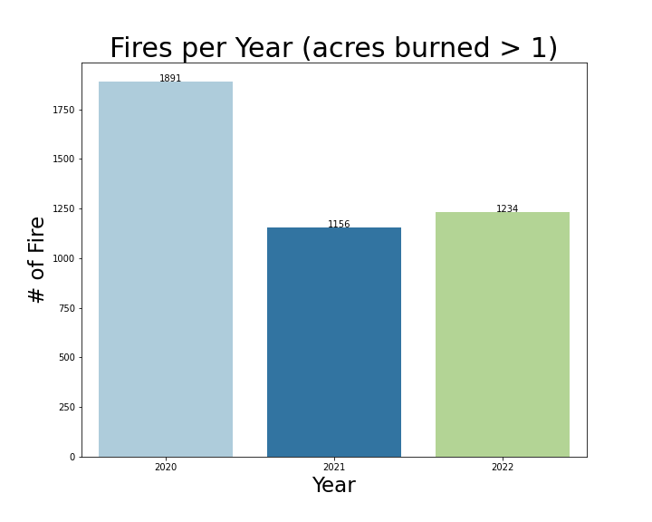
> Dataset we have mainly includes fire datasets from 3 years and 2022 when amount of fires has peaked between these years. Next I want to see what it looks like per month

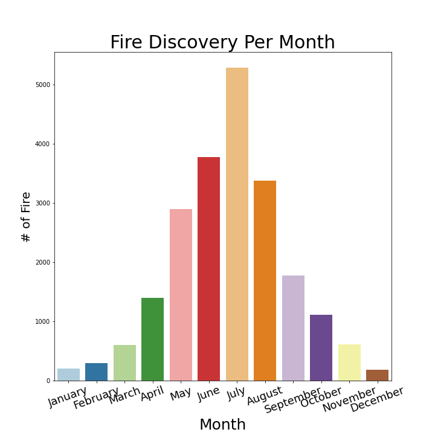
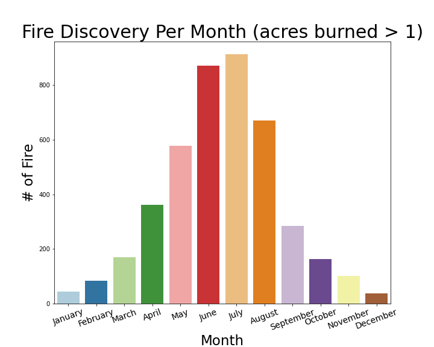
> Charts show highest peak is between april and september. Next is interesting to look at which day of the week has most fires accrued for peak months

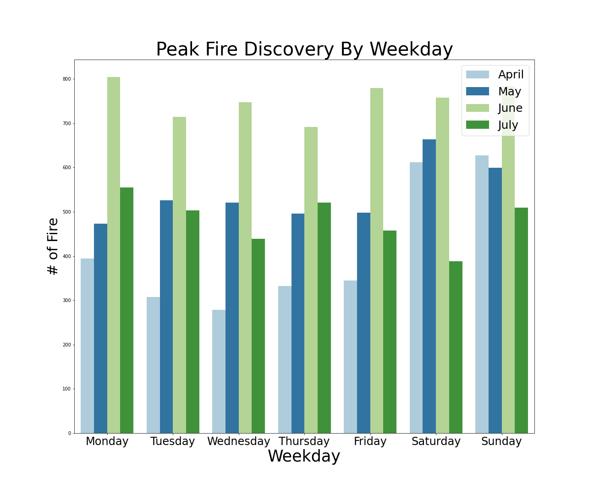
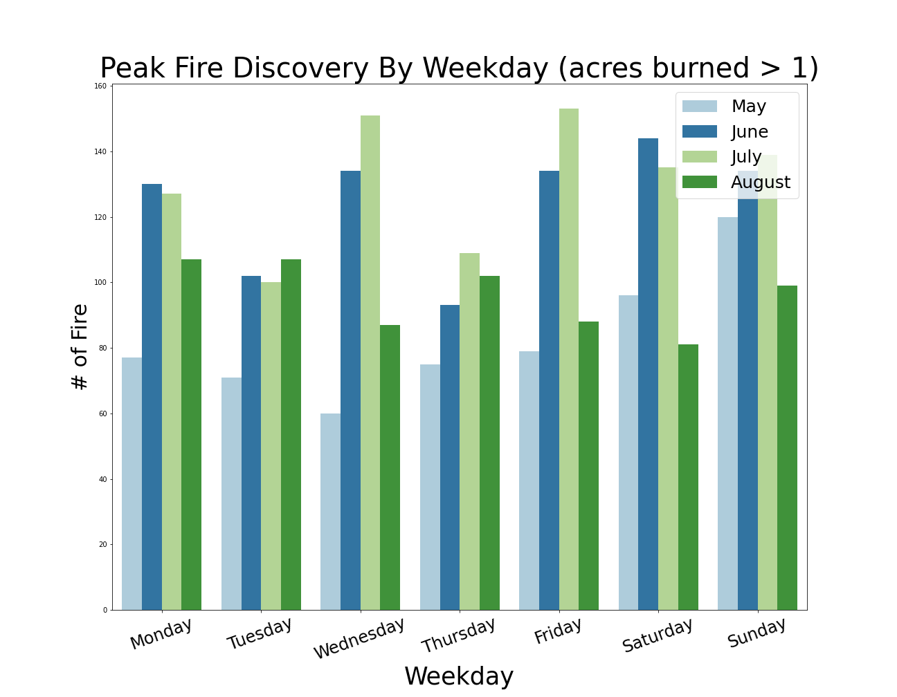
> Chart shows that fires started regardless of day of the week. Next is interesting to look at what caused the fire during peak fire months

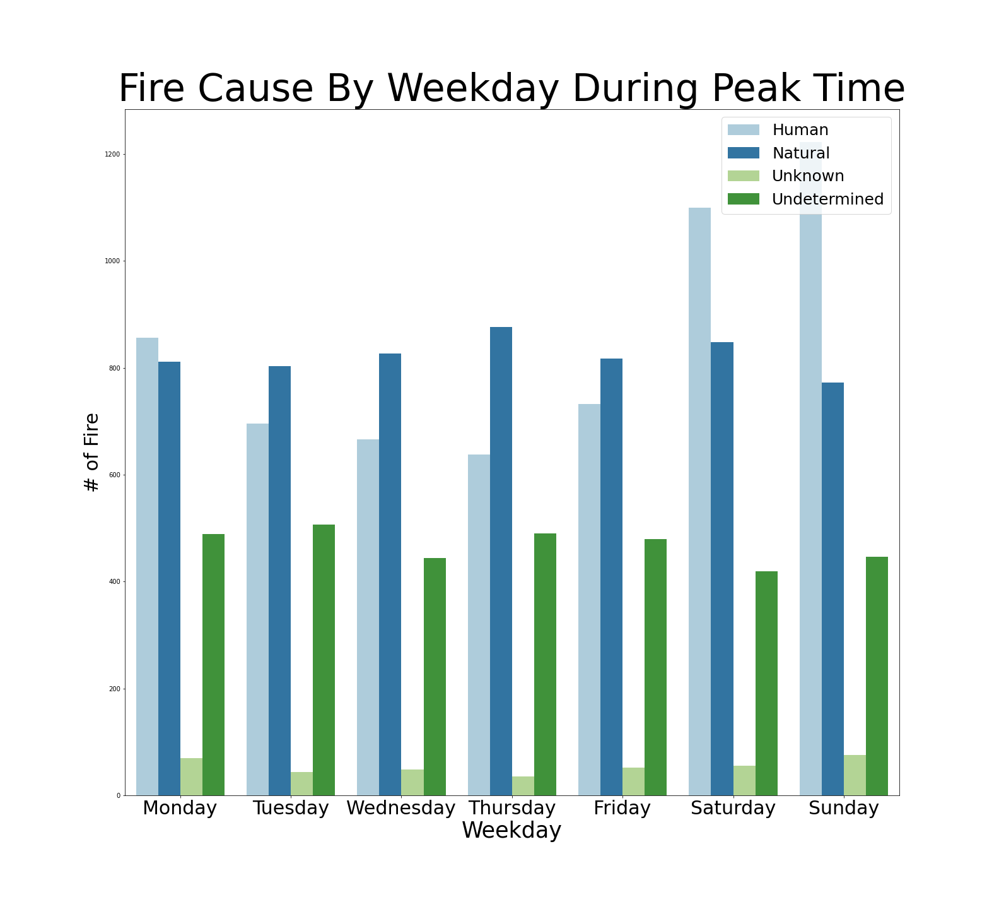

> Natural cause of fire dominates during weekday and human cause peaks during weekend which makes sense since more people go camping and increase the risk

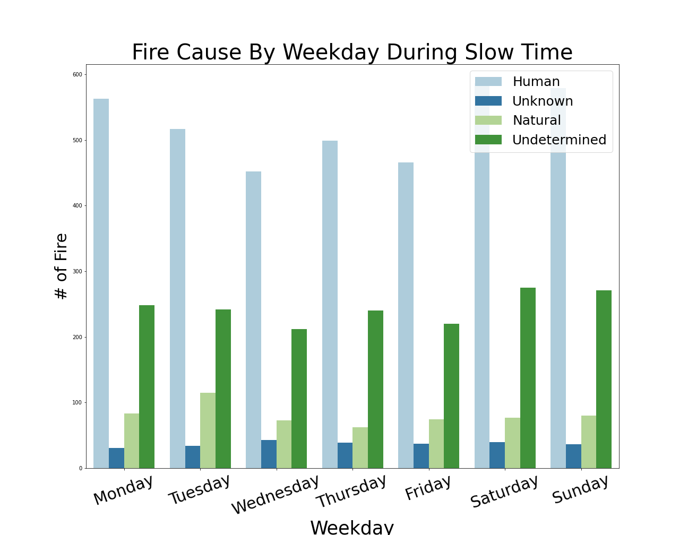
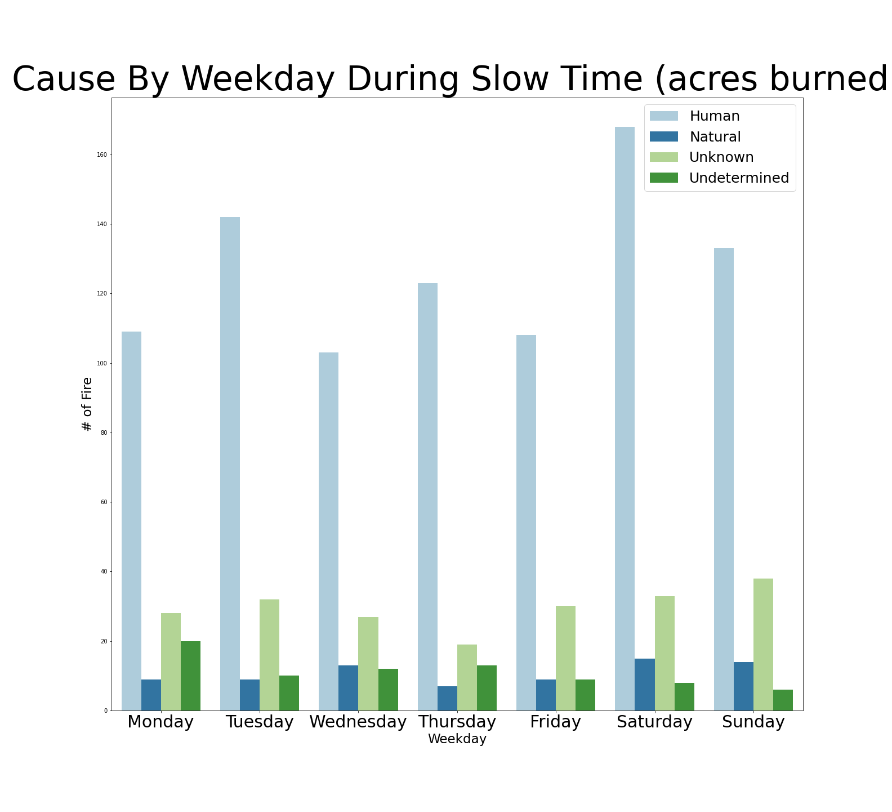
> During slow fire season natural causes dominates across the board. Next it is interesting to find what is common conditions for peak fire.

> New Mexico and California are leading for having the most wildfires. However Utah is leading for number of big wildfires 

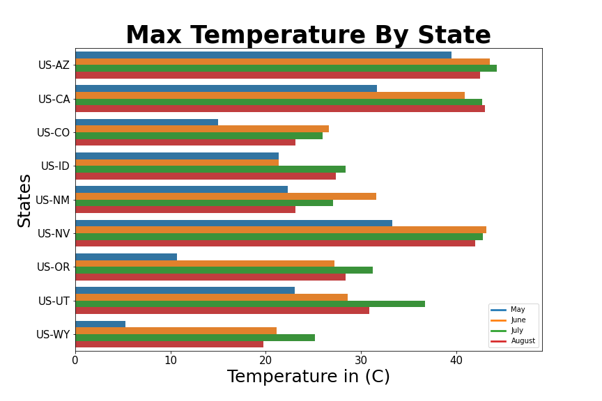
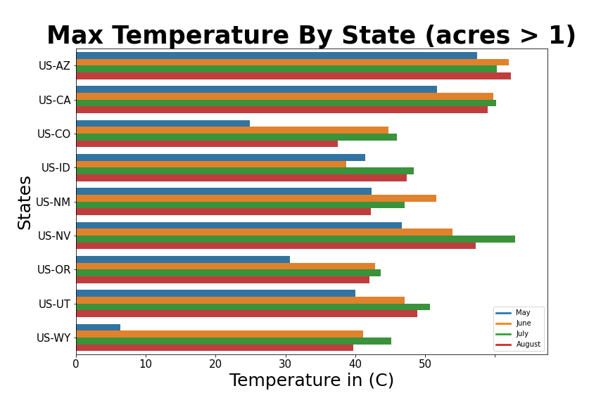
> Temperature does not show any correlation with wildfires by itself

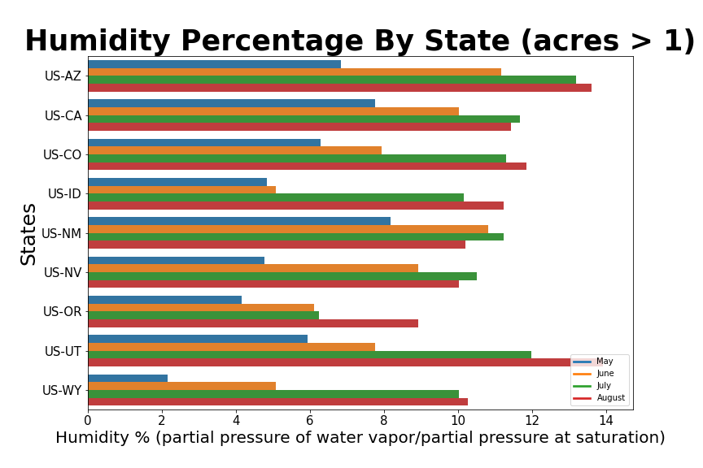
> Humidity showed more impact on condition of fuel moisture and creates better environment for fire to catch on

> Wind helps wildfire to spread is flatter elevations

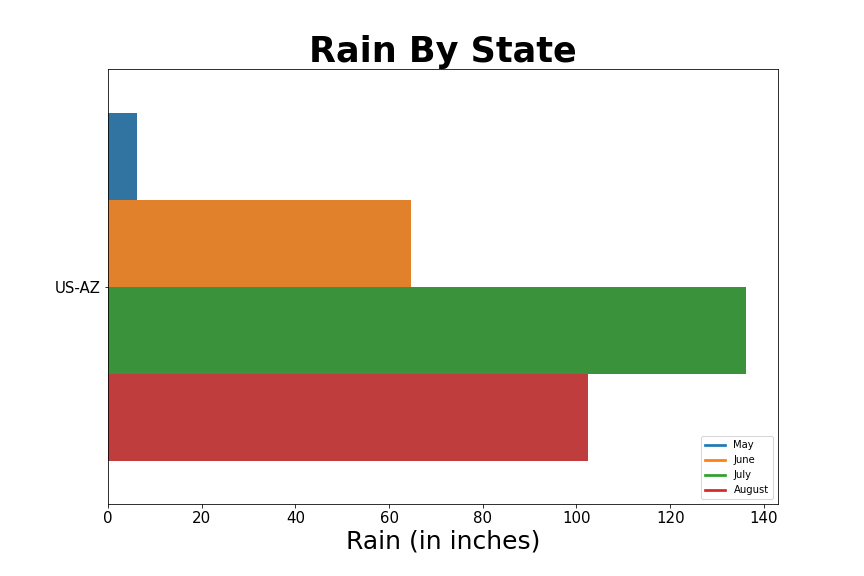
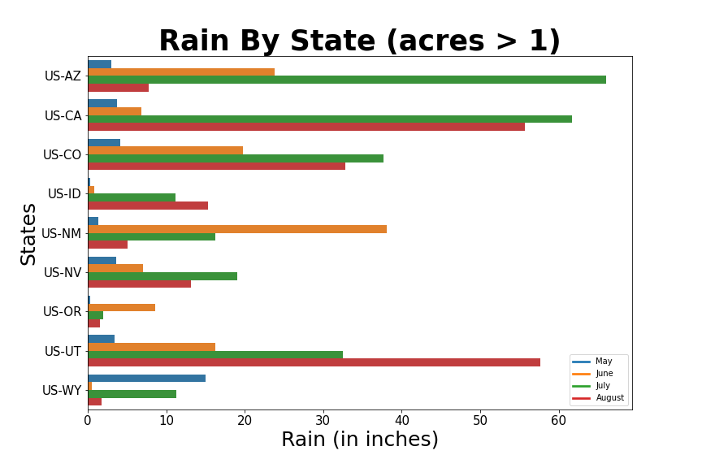
> It’s highly possible when Arizona started having more rain, it directly caused number of wildfires when it was peaking during May

> Even if Utah had a lot of wildfires, the response time to contain wildfire was impressive

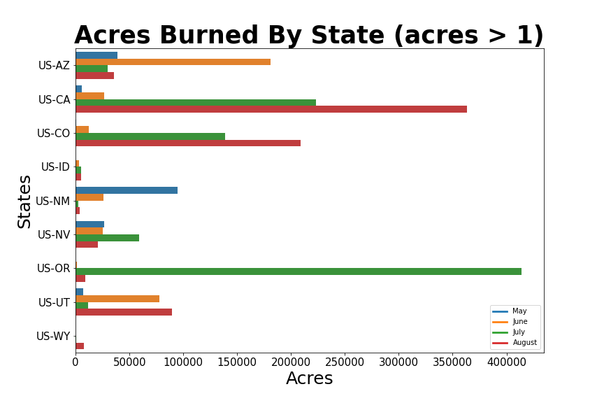
> Oregon had 354 reported wildfires during peak months but had highest acres lost to fire

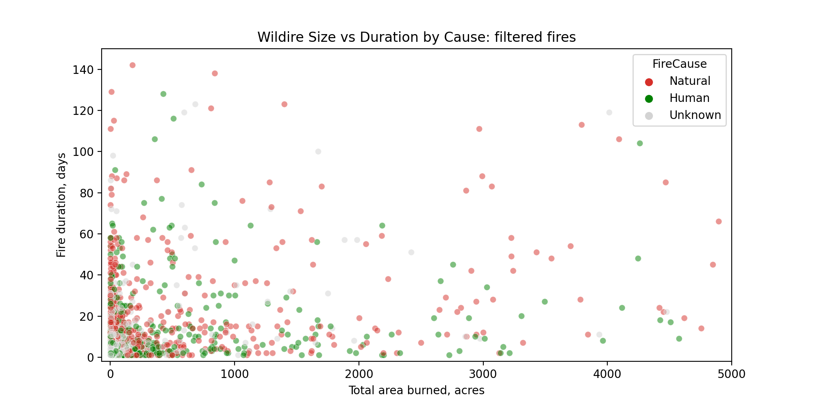

----
## Conclusion & Recommendation
